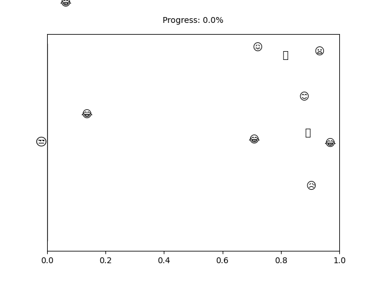

# PhD Thesis Progress Tracker

<td style="width: 10%; padding: 10px; border: none;">
      
</td>

## :calendar: My Progress

- Today: 04/11/2024
- PhD Start Date: 24/08/2020
- PhD End Date: 05/01/2026

- Time Spent: 1534 days
- Time Left: 543 days
- Completion: <b>73.86%</b>
- Progress: [#########################################################################---------------------------]

## 📈 Publications

## Presentations

## Workshops Attended

## Thanks

Thanks to [@pvtien96](https://github.com/pvtien96) for this incredibly cool idea!
