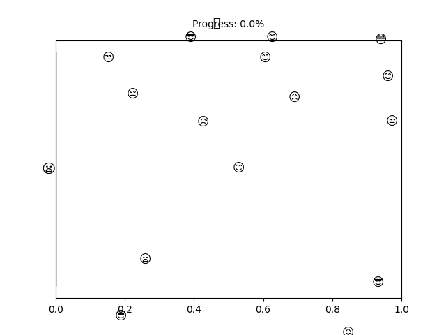

# PhD Thesis Progress Tracker

<td style="width: 10%; padding: 10px; border: none;">
      
</td>

## :calendar: My Progress

- Today: 03/09/2024
- PhD Start Date: 24/08/2020
- PhD End Date: 12/12/2025

- Time Spent: 1472 days
- Time Left: 465 days
- Completion: <b>75.99%</b>
- Progress: [###########################################################################-------------------------]

## 📈 Publications

## Presentations

## Workshops Attended

## Thanks

Thanks to [@pvtien96](https://github.com/pvtien96) for this incredibly cool idea!
